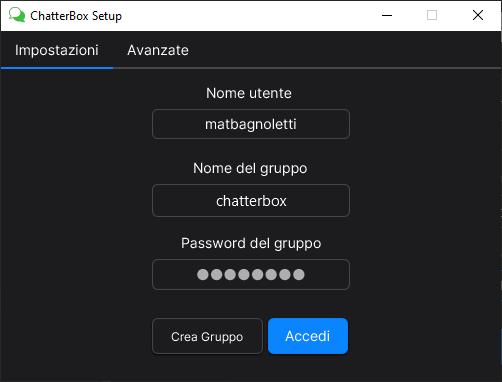
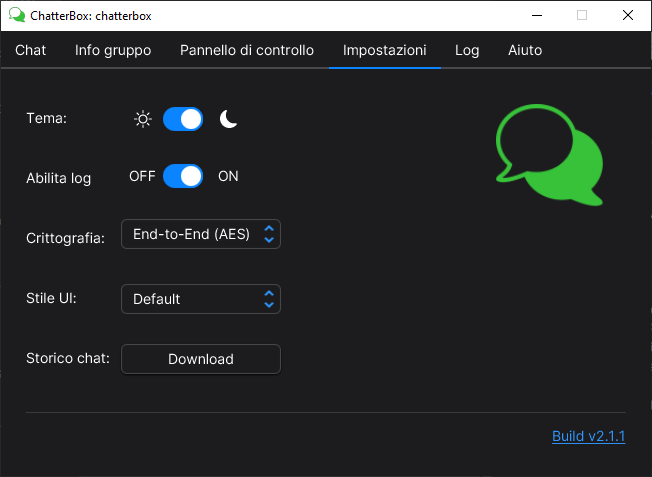

<h1 align="center">ChatterBox</h1>

<p align="center" style="font-family: monospace">Made by <a href="https://github.com/matbagnoletti">@matbagnoletti</a></p>
<p align="center" style="font-family: monospace">Docenti: prof.ssa <a href="https://github.com/mciuchetti">@mciuchetti</a> e prof.ssa Fioroni</p>
<p align="center" style="font-family: monospace">Corso TPSIT a.s. 2023/2024, <a href="https://www.avoltapg.edu.it/">ITTS A. Volta (PG)</a></p>
<p align="center">
    
    
</p>

## Descrizione
ChatterBox è un'applicazione di chat che sfrutta il protocollo UDP in modalità multicast per la comunicazione tra più utenti. Il programma permette la creazione di un gruppo chat, la gestione degli utenti e la comunicazione in tempo reale.
L'interfaccia grafica utilizzata è stata realizzata con JavaFX, mentre la gestione della comunicazione è affidata a Java e Kotlin.

## Requisiti
- [JDK](https://www.oracle.com/it/java/technologies/downloads/) (v22.0.1)
- [JavaFX](https://openjfx.io/) (v22.0.1)
- [Maven](https://maven.apache.org/download.cgi)

È possibile visualizzare le versioni già presenti sul proprio dispositivo mediante i seguenti comandi:
```bash
java -version
mvn -v
```

## Installazione e utilizzo
1. Scaricare il file compresso del progetto e decomprimerlo in una cartella locale.
2. Aprire il terminale nella cartella del progetto
3. Eseguire il comando per l'avvio dell'applicazione: 
    ```bash
    # Assicurati di sostituire '${PATH-TO-JAVAFX-LIB}' con il percorso completo della cartella 'lib' di JavaFX.
    java --module-path ${PATH-TO-JAVAFX-LIB} --add-modules javafx.controls,javafx.fxml,javafx.web,javafx.graphics -jar .\out\artifacts\ChatterBox_jar\ChatterBox.jar
    ```

In alternativa è possibile eseguire il progetto direttamente da un IDE come IntelliJ IDEA.

## Struttura e funzionamento
Il progetto si compone da 2 packages principali:

- Package [`chatterbox`](src/main/kotlin/edu/avolta/tpsit/chatterbox): contiene le classi di gestione dell'interfaccia grafica JavaFX e la classe principale `ChatterBox`.
- Package [`multicastudpsocketchat`](src/main/kotlin/edu/avolta/tpsit/multicastudpsocketchat): contiene le classi di gestione della chat, il cui progetto di riferimento è disponibile [qui](https://www.github.com/matbagnoletti/MulticastUDPSocketChat).

### Utilizzo
1. All'avvio dell'applicazione, una schermata di setup permetterà all'utente la configurazione del proprio profilo e le impostazioni di connessione al gruppo chat.
   <div align="center">
      
   </div> 
   
   Il nome utente non può essere nullo. L'indirizzo IP del gruppo deve essere di classe D multicast globale (da 224.0.1.0 - 238.255.255.255 esclusi) e la porta deve essere compresa tra 1024 e 65535.

   <div align="center">
        
   </div>
   
   Il TTL (Time To Live) è un valore che determina il numero di router attraverso i quali il datagramma può passare. Un valore di 1 indica che il datagramma non può lasciare la sottorete locale, mentre un valore di 255 indica che il datagramma può attraversare un numero illimitato di router. Il valore di default è 128. Per quanto riguarda il loopback dei datagrammi, invece, è possibile disattivarlo per alleggerire il traffico di rete nel solo caso in cui multiple istanze dell'applicazione NON siano eseguite sullo stesso dispositivo.
   
2. Una volta configurato il profilo, l'utente verrà reindirizzato alla schermata principale dell'applicazione. Qui sarà possibile visualizzare i messaggi inviati dagli altri utenti del gruppo chat e inviare messaggi propri.
   <div align="center">
        
   </div>
   Il pulsante "Termina" permette di chiudere la connessione al gruppo chat.
   Una volta terminata la chat, l'utente potrà riconnettersi al gruppo chat mediante il pulsante "Riconnetti".
   Ogni messaggio inviato o ricevuto è accompagnato dal nome utente, dall'orario di invio e da un'icona che indica se il messaggio è stato ricevuto correttamente da tutti gli utenti online in quell'instante.

   La barra di navigazione in alto permette di visualizzare i dettagli del gruppo chat e di modificare le impostazioni di connessione.
   <div align="center">
      <h4>Pannello di controllo: informazioni sull'esecuzione</h4>
      
   </div>
   In questo esempio gli indirizzi IP e i numeri di porta sono stati nascondi per motivi di privacy.
   <div align="center">
      <h4>Impostazioni: layout e controlli</h4>
      
   </div>
   <div align="center">
      <h4>Aiuto: a proposito di ChatterBox e comandi</h4>
      
   </div>

## Licenza d'uso
Questo progetto (e tutte le sue versioni) sono rilasciate sotto la [MB General Copyleft License](LICENSE).
